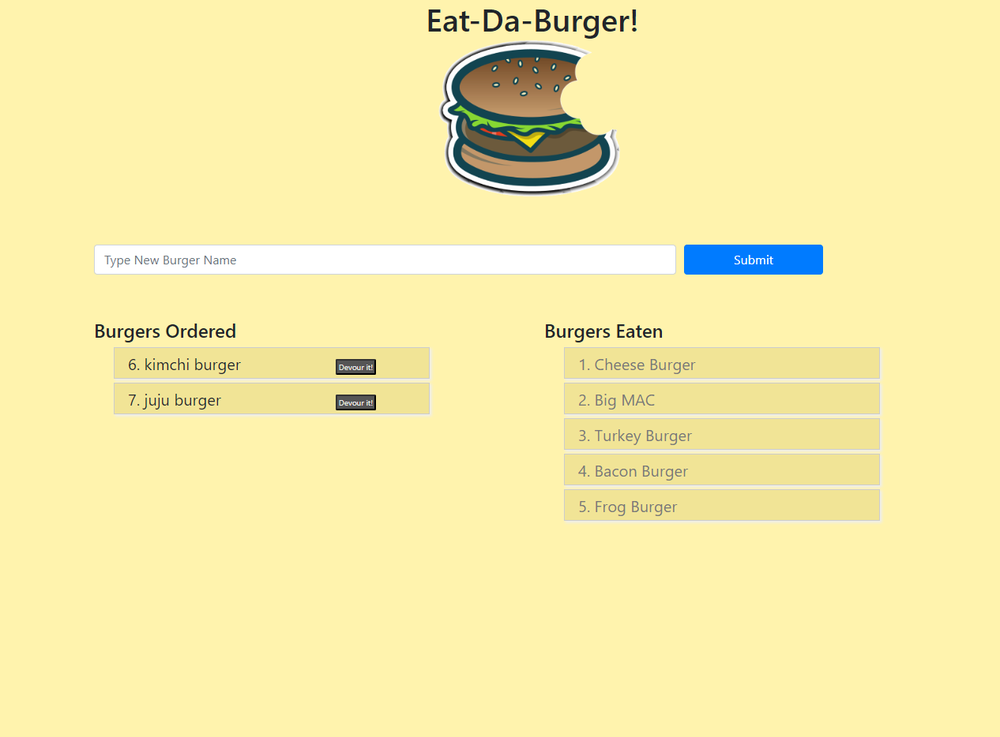

# Eat-Da-Burger!

##  12:_Node_Express_Handlebars_

Try out the app at: https://shielded-stream-23766.herokuapp.com/

    
### Handlebar  &  ORM Assignment
* Eat-Da-Burger! is a restaurant app that lets users input the names of burgers they'd like to eat.

* Whenever a user submits a burger's name, your app will display the burger on the left side of the page -- waiting to be devoured.

* Each burger in the waiting area also has a `Devour it!` button. When the user clicks it, the burger will move to the right side of the page.

* Your app will store every burger in a database, whether devoured or not.

* [Class provided video of the app you need to make](https://youtu.be/msvdn95x9OM).